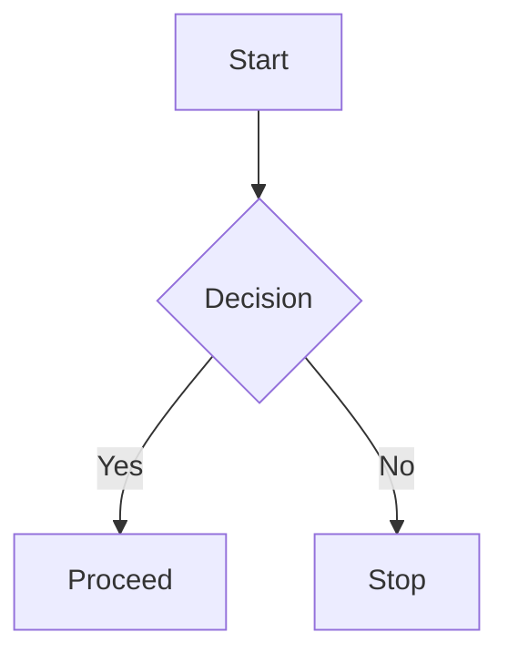

## 1. Code Blocks with Syntax Highlighting

**Description:**  
Use triple backticks followed by the language name (e.g., `python`) to enable syntax highlighting for code in Obsidian. This improves readability and structure for technical documentation.

**Example:**

```Python
def greet_person(name):
    print(f"Hello, {name}!")

greet_person("Afrid")
```

---
## 2. Callouts (Info Boxes)

**Description:**  
Callouts are custom-styled blocks in Obsidian used to emphasize notes, warnings, tips, etc. Use `>[!TYPE]` followed by your content.

**Example:**

>[!tip] Quick Reminder
>Use callouts to highlight important ideas or quick tips in your notes.

---

## 3. Mermaid Diagrams

**Description:**  
Mermaid allows you to create diagrams like flowcharts using simple text syntax. Wrap the code in a `mermaid` code block.

**Example:**


---

## 4. Task Lists (Checkboxes)

**Description:**  
Create interactive to-do lists using `- [ ]` for unchecked and `- [x]` for checked boxes. Obsidian can track and query these tasks.

**Example:**

- [ ] Learn Markdown basics 
- [x] Install Obsidian 
- [ ] Use Dataview for automation`

---

## 5. Internal Links

**Description:**  
Link to other notes using double square brackets. This keeps your vault connected and searchable.

**Example:**

Refer to [[Advanced Obsidian Features]] for deeper insights.`

---

## 6. Embedding Notes or Files

**Description:**  
Embed content from other notes, PDFs, images, or audio using an exclamation mark before the link.

**Example:**

![[My Diagram Note]] ![[resources/cheatsheet.pdf]] ![[images/logo.png]]`

---

