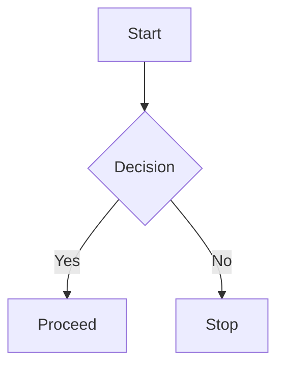

## 1. Code Blocks with Syntax Highlighting

**Description:**  
Use triple backticks followed by the language name (e.g., `python`) to enable syntax highlighting for code in Obsidian. This improves readability and structure for technical documentation.

**Example:**

```Python
def greet_person(name):
    print(f"Hello, {name}!")

greet_person("Afrid")
```

---
## 2. Callouts (Info Boxes)

**Description:**  
Callouts are custom-styled blocks in Obsidian used to emphasize notes, warnings, tips, etc. Use `>[!TYPE]` followed by your content.

**Example:**

>[!tip] Quick Reminder
>Use callouts to highlight important ideas or quick tips in your notes.

---

## 3. Mermaid Diagrams

**Description:**  
Mermaid allows you to create diagrams like flowcharts using simple text syntax. Wrap the code in a `mermaid` code block.

**Example:**


---

## 4. Task Lists (Checkboxes)

**Description:**  
Create interactive to-do lists using `- [ ]` for unchecked and `- [x]` for checked boxes. Obsidian can track and query these tasks.

**Example:**

- [ ] Learn Markdown basics 
- [x] Install Obsidian 
- [ ] Use Dataview for automation`

---

## 5. Internal Links

**Description:**  
Link to other notes using double square brackets. This keeps your vault connected and searchable.

**Example:**

Refer to [[Advanced Obsidian Features]] for deeper insights.

---

## 6. Embedding Notes or Files

**Description:**  
Embed content from other notes, PDFs, images, or audio using an exclamation mark before the link.

**Example:**

![[My Diagram Note]] ![[resources/cheatsheet.pdf]] ![[images/logo.png]]`

---

## 7. Dataview Plugin (Inline Query)

**Description:**  
Use the Dataview plugin to query your notes like a database. Inline queries allow displaying dynamic values.

**Example:**

markdown

CopyEdit

`` Task status: `= this.completed` ``

> _(Assuming your note uses frontmatter like `completed: true`)_

---

## 8. Dataview Plugin (Table Query)

**Description:**  
Generate dynamic tables from your notes using specific tags, fields, or folders.

**Example:**

markdown

CopyEdit

` ```dataview table file.name, status, due from "Tasks/Projects" where status = "ongoing" sort due asc `


## 9. Canvas (Visual Note Mapping)

**Description:**  
Canvas lets you create visual boards with notes, cards, and links. Great for brainstorming or project overviews.

**Example:**  
Just create a `.canvas` file and drag notes or write directly into cards.

markdown

CopyEdit

``- Create a new Canvas file (e.g., `project.canvas`) - Drag and arrange notes visually - Add new cards with markdown``

> _(Canvas is visual, so you interact with it more than you write code.)_

---

## 10. Daily Notes & Templates

**Description:**  
Obsidian can generate a new note every day using a custom template. Perfect for journaling, task tracking, or reviews.

**Example Template (saved in Templates folder):**

markdown

CopyEdit

`# 📅 {{date}}  ## Goals - [ ] Task 1 - [ ] Task 2  ## Notes - {{time}} — Quick log entry`

Then configure **Daily Notes** in Obsidian Settings → Core Plugins.

---

## 11. Frontmatter YAML

**Description:**  
YAML frontmatter stores metadata at the top of a note. It’s used by plugins like Dataview, graph filters, and more.

**Example:**

markdown

CopyEdit

`--- title: Project Alpha tags: [project, alpha] status: ongoing due: 2025-06-15 ---`

---

## 12. Tags & Aliases

**Description:**  
Tags help categorize notes. Aliases let you link to the same note with different names.

**Example:**

markdown

CopyEdit

`--- tags: [design, obsidian] aliases: ["Obsidian Tips", "Advanced Obsidian"] ---`

Now you can link using `[[Advanced Obsidian]]` or `[[Obsidian Tips]]`.

---

## 13. Custom CSS Snippets

**Description:**  
Customize how Obsidian looks using `.css` snippets. Enable the _"Custom CSS"_ plugin, then save `.css` files in `.obsidian/snippets`.

**Example:**

/* Make headings bold and colorful */
h1 {   color: #ff7b00;   font-weight: 800; }

# Enable this from **Settings → Appearance → CSS snippets**.


`[[picture.png]]` will make a link and `![[picture.png]]` will embed the picture.