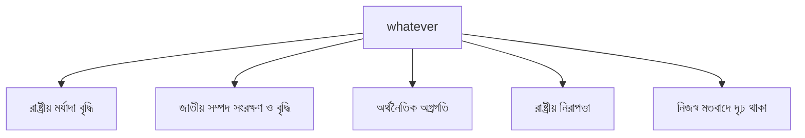

#### 1. What is a Function?
- A **function** is a block of code designed to do a specific task.  
- You can **call** it anytime you want to run that task, instead of rewriting code.
---

#### 2. Defining a Function
- Use the keyword `def` to define a function.
- Here, `greet` is a function that prints a message.
```Python
def greet():
	print("Hello, Afrid!")
```
---

#### **3. Calling a Function**
- To run the function, just call its name with parentheses:
```Python
greet()    # Hello, Afrid!
```
---

#### 4. Function Parameters (Inputs)
- Functions can take inputs called **parameters** or **arguments**:
```Python
def greet(name):
	print(f"Hello, {name}!")
```

**Call it with an argument:**
```Python
greet("Afrid")    # Hello, Afrid!
```
---

#### **5. Returning Values**
- Functions can send back a value using `return`:
```Python
def add(a, b):
	return a + b
result = add(5, 3)
	print(result)    # 8
```
---

#### 6. Why use `return`?
- It lets you **use the result** later in your program.
- Without `return`, functions just do something but don’t send a result back.
---

#### 7. Example: Function with both input and output
```Python
def square(num):
	return num * num
	print(square(4))  # Output: 16
```
---


